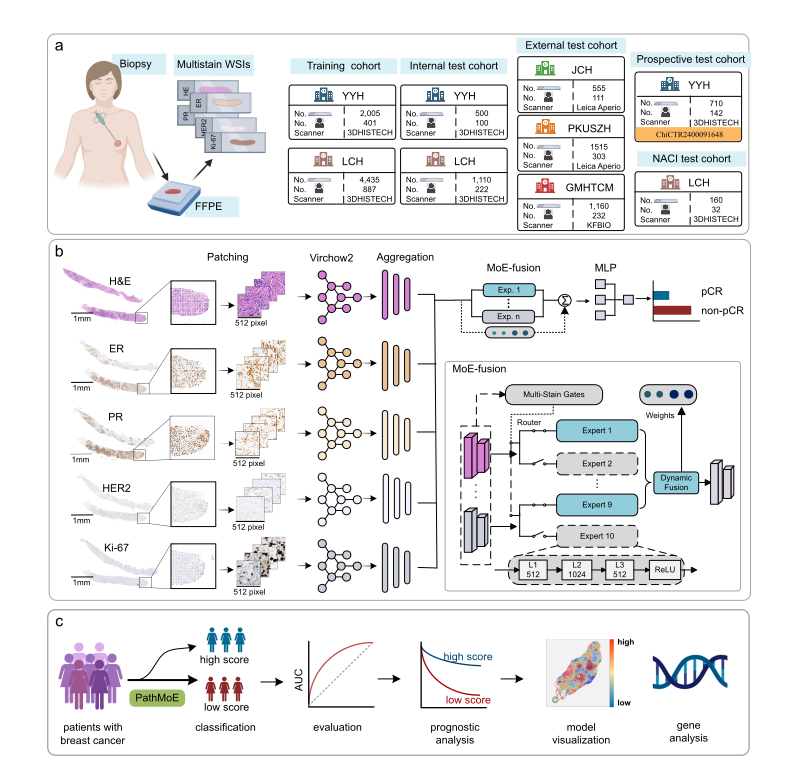

# PathMoE

Neoadjuvant therapy efficacy assessment is critical for prognostic evaluation and clinical decision-making in locally advanced breast cancer. This study developed an AI-based pathological multistain mixture-of-expert model, PathMoE, to predict pathological complete response (pCR) to Neoadjuvant chemotherapy (NAC) using pre-treatment breast biopsy whole slide images (WSIs) from multistain (H\&E, ER, PR, HER2, and Ki-67). Leveraging Virchow2, a large-scale pathology foundation model, we extracted generalizable WSI representations and integrated them through a multi-instance, expert-gated fusion strategy. PathMoE was trained and tested on 12,150 WSIs from 2,430 patients across five medical centers. Across independent external cohorts and a prospective cohort, analyses consistently demonstrated that PathMoE achieved robust pCR prediction, with added potential to predict response to combined neoadjuvant chemoimmunotherapy (NACI). PathMoE enabled robust risk stratification and served as an independent prognostic indicator. Model attention maps highlighted anti-tumor immune cell patterns as key decision drivers, while RNA sequencing (RNA-seq) linked high PathMoE scores to immune-related pathways. Collectively, these findings suggest that PathMoE is a promising tool for predicting pCR to NAC  and personalized management in breast cancer. 



## Installation

First clone the repo and cd into the directory:
```shell
git clone https://github.com/yyyhd/PathMoE
cd PathMoE
```

Create a new enviroment with anaconda.
```shell
conda create -n PathMoE python=3.10 -y --no-default-packages
conda activate PathMoE
pip install --upgrade pip
pip install -r requirements.txt
pip install -e .
```
## Model Download

The MUSK models can be accessed from [HuggingFace Hub](https://huggingface.co/zzhuo-cs/PathMoE/resolve/main/pytorch_model.pt).

## Model Weights Usage

Please place the downloaded model weights file (e.g., `pytorch_model.pt`) in the following directory:
```
/Checkpoints
├── pytorch_model.pt
```
## Image Processing Pipeline
### Extract Tiles from Whole Slide Images
Preprocess the slides following [CLAM](https://github.com/mahmoodlab/CLAM), including foreground tissue segmentation and stitching.
### Extract Image Feature Embeddings
Download the pretrained [Virchow2 model weights](https://huggingface.co/paige-ai/Virchow2), put it to ./weights/ and load the model.


## Evaluation
To reproduce the results in our paper, we provide a reproducible result on JCH cohort.
- First download our processed [JCH cohort](https://pan.baidu.com/s/1JoMIK0xfONqJYBVVLLjK9A?pwd=m7pw) frozen features here
- Put the extracted features to *./features/*
- Run the following command:
```
python eval.py
```
The test_error and auc will be printed to the screen.
```
test_error:  0.1981981981981982   auc:  0.8565840938722296
```
The evaluation results will be stored at `eval_results/EVAL_first/`.

## Acknowledgements
The project was built on many amazing open-source repositories: [Virchow2](https://huggingface.co/paige-ai/Virchow2) and [CLAM](https://github.com/mahmoodlab/CLAM). We thank the authors and developers for their contributions.


## Issues
Please open new threads or address questions to maoning@pku.edu.cn or sen.yang.scu@gmail.com

## License
ProgPath is made available under the CC BY-NC-SA 4.0 License and is available for non-commercial academic purposes.
